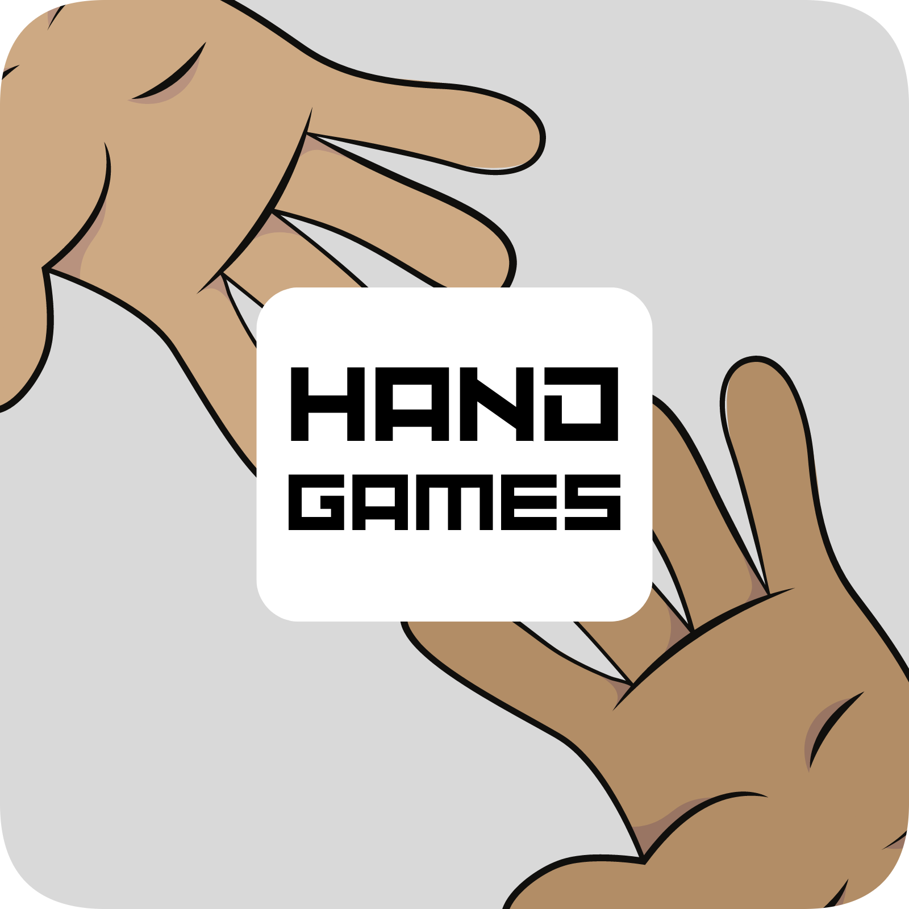

# Hand Games

<p align="center">
  
</p>

## :books: Descrição ##
Hand Games é uma aplicação interativa que utiliza a webcam e técnicas de visão computacional para permitir que os jogadores joguem três jogos clássicos: Jokenpô, Par ou Ímpar e Número Mais Próximo.

O projeto exibe uma interface intuitiva na tela, onde os jogadores podem escolher qual jogo desejam jogar. Há opções claras para Jokenpô, Par ou Ímpar e Número Mais Próximo. Utiliza a webcam para capturar as imagens das mãos dos jogadores. Por meio de algoritmos de visão computacional, ele identifica e rastreia as mãos em tempo real.

### :boat: Navegação pelos projetos: ###
- \> hand-games
- [hand-games-gui](https://github.com/JoaoErick/hand-games-gui)

## :memo: Manuais
- [Jokenpô](./manuals/JOKENPO.md)
- [Par ou Ímpar](./manuals/EVEN-ODD.md)
- [Número Mais Próximo](./manuals/NEAREST-NUMBER.md)

## :video_game: Como jogar
1. Para utilizar este projeto, é necessário primeiramente instalar a dependência [hand-tracking](https://github.com/AllanCapistrano/handtracking) e as demais:
   ```powershell
   pip install -U git+https://github.com/AllanCapistrano/hand-tracking.git
   pip install -r requirements.txt
   ```
2. Clone este repositório;
3. Adicione as variáveis de ambiente, e caso necessário, modifique-as:
   ```powershell
   cp .env.example .env
   ```
4. Execute o projeto:
   ```powershell
   # Linux/macOS
   python3 src/main.py

   # Windows
   py src/main.py
   ```

## :pushpin: Autores ##
- Allan Capistrano: [Github](https://github.com/AllanCapistrano) - [Linkedin](https://www.linkedin.com/in/allancapistrano/) - [E-mail](https://mail.google.com/mail/u/0/?view=cm&fs=1&tf=1&source=mailto&to=asantos@ecomp.uefs.br)
- João Erick Barbosa: [Github](https://github.com/JoaoErick) - [Linkedin](https://www.linkedin.com/in/joão-erick-barbosa-9050801b0/) - [E-mail](https://mail.google.com/mail/u/0/?view=cm&fs=1&tf=1&source=mailto&to=jsilva@ecomp.uefs.br)

------------

## :balance_scale: Licença ##
[GPL 3.0 License](./LICENSE)
