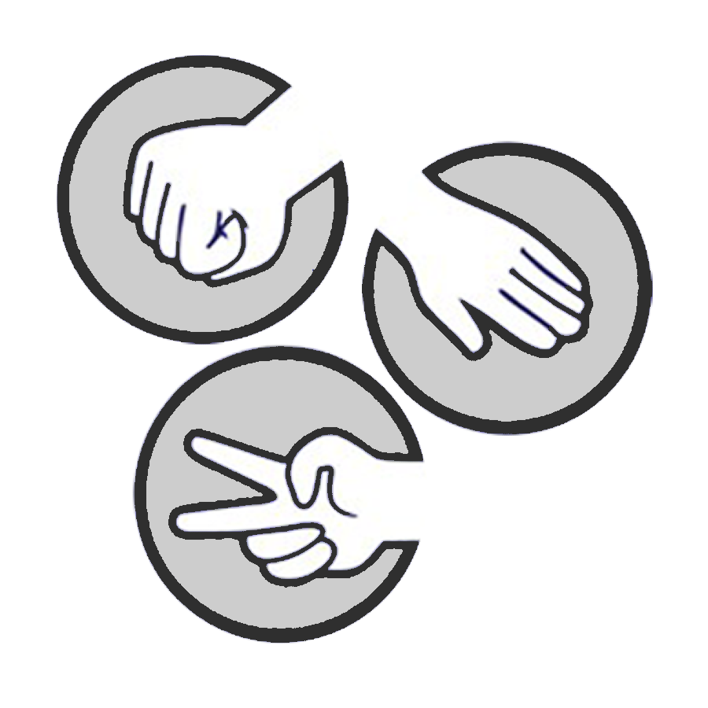

# Jokenpô

  

## :books: Descrição ##
O jogo Jokenpo, também conhecido como Pedra, Papel e Tesoura, é um jogo de mão disputado por duas pessoas. O objetivo é escolher um dos três símbolos - pedra, papel ou tesoura - de forma a vencer o oponente.

## :video_game: Como jogar
O jogo é jogado por dois jogadores. Para jogar, os participantes fazem um gesto com a mão direcionada para a Webcam representando um dos três símbolos. Em seguida, os gestos são revelados simultaneamente e determina-se o vencedor de acordo com as regras mencionadas abaixo.

## :scroll: Regras
- A pedra vence a tesoura (porque a quebra);
- A tesoura vence o papel (porque o corta);
- O papel vence a pedra (porque a embrulha);
- Se ambos os jogadores escolherem o mesmo símbolo, o jogo é considerado um empate.